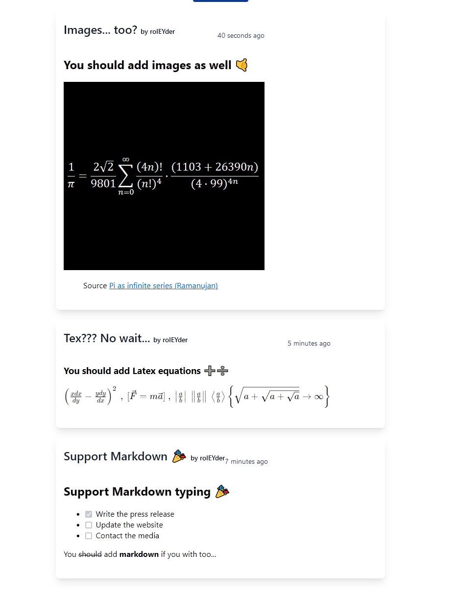

<div id="top"></div>

<!-- PROJECT LOGO -->
<br />
<div align="center">
  <a href="https://github.com/RolEYder/ilta-interactive-wall">
    
  </a>

  <h3 align="center">ITLA Intarctive Wall</h3>

  <p align="center">
 Scholar web app to post content about ITLA and things that happen there.
    <br />
    <a href="https://github.com/RolEYder/ilta-interactive-wall"></a>
    <br />
    <br />
    <a href="https://ilta-interactive-wall.vercel.app/">View Demo</a>
</div>

<!-- TABLE OF CONTENTS -->
<details>
  <summary>Table of Contents</summary>
  <ol>
    <li>
      <a href="#about-the-project">About The Project</a>
      <ul>
        <li><a href="#built-with">Built With</a></li>
      </ul>
    </li>
    <li>
      <a href="#getting-started">Getting Started</a>
      <ul>
        <li><a href="#prerequisites">Prerequisites</a></li>
        <li><a href="#installation">Installation</a></li>
      </ul>
    </li>
    <li><a href="#license">License</a></li>
  </ol>
</details>

<!-- ABOUT THE PROJECT -->

## About The Project

<a href="assets/main.png">
    
  </a>

The project was created as part of my last web programming assignment.

### Built With

This project was made with:

- [React.js](https://reactjs.org/)
- [Typescript](https://www.typescriptlang.org/)
- [Firebase](https://firebase.google.com/)
- [Tailwindcss](https://tailwindcss.com/)

<!-- GETTING STARTED -->

## Getting Started

This is an example of how you may give instructions on setting up your project locally. To get a local copy up and running, follow these simple example steps.

### Prerequisites

To run the project successfully, you must have already installed the mentioned tools.

### Installation

Below is an example of how to install and set up the project successfully.

1. Clone the repo
   ```sh
   git clone https://github.com/RolEYder/ilta-interactive-wall
   ```
2. Install NPM packages
   ```sh
   npm install
   ```


3. Then create a file `.env` at the root project location and replace for your own configuration

```bash
REACT_APP_FIREBASE_API_KEY = ""
REACT_APP_FIREBASE_AUTH_DOMAIN = ""
REACT_APP_FIREBASE_DATABASE_URL = ""
REACT_APP_FIREBASE_PROJECT_ID = ""
REACT_APP_FIREBASE_STORAGE_BUCKET = ""
REACT_APP_FIREBASE_MESSAGING_SENDER_ID = ""
REACT_APP_FIREBASE_APP_ID = ""
REACT_APP_FIREBASE_MEASUREMENT_ID = "" 
```
4. Run the app

```sh
npm run start
```
and open the app at localhost:3000

<!-- LICENSE -->

## License

Distributed under the MIT License. See `LICENSE.txt` for more information.


<!-- MARKDOWN LINKS & IMAGES -->
<!-- https://www.markdownguide.org/basic-syntax/#reference-style-links -->

[contributors-shield]: https://img.shields.io/github/contributors/othneildrew/Best-README-Template.svg?style=for-the-badge
[contributors-url]: https://github.com/othneildrew/Best-README-Template/graphs/contributors
[forks-shield]: https://img.shields.io/github/forks/othneildrew/Best-README-Template.svg?style=for-the-badge
[forks-url]: https://github.com/othneildrew/Best-README-Template/network/members
[stars-shield]: https://img.shields.io/github/stars/othneildrew/Best-README-Template.svg?style=for-the-badge
[stars-url]: https://github.com/othneildrew/Best-README-Template/stargazers
[issues-shield]: https://img.shields.io/github/issues/othneildrew/Best-README-Template.svg?style=for-the-badge
[issues-url]: https://github.com/othneildrew/Best-README-Template/issues
[license-shield]: https://img.shields.io/github/license/othneildrew/Best-README-Template.svg?style=for-the-badge
[license-url]: https://github.com/othneildrew/Best-README-Template/blob/master/LICENSE.txt
[linkedin-shield]: https://img.shields.io/badge/-LinkedIn-black.svg?style=for-the-badge&logo=linkedin&colorB=555
[linkedin-url]: https://linkedin.com/in/othneildrew

